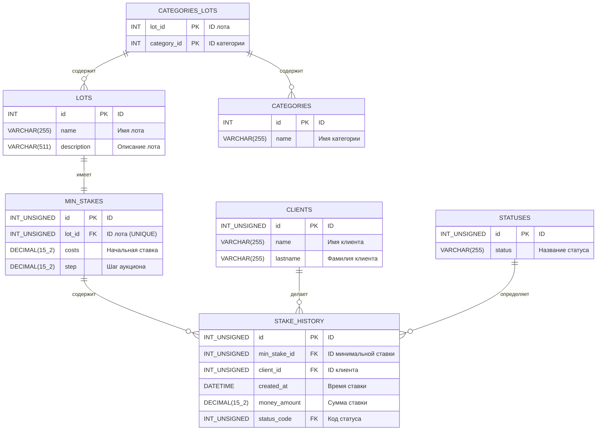

# ER-Диаграмма

```mermaid
erDiagram
    LOTS ||--|| MIN_STAKES : "имеет"
    MIN_STAKES ||--o{ STAKE_HISTORY : "содержит"
    CLIENTS ||--o{ STAKE_HISTORY : "делает"
    STATUSES ||--o{ STAKE_HISTORY : "определяет"
    CATEGORIES_LOTS ||--o{ LOTS : "содержит"
    CATEGORIES_LOTS ||--o{ CATEGORIES : "содержит"

    CATEGORIES {
        INT id PK "ID"
        VARCHAR(255) name "Имя категории"
    }

    LOTS {
        INT id PK "ID"
        VARCHAR(255) name "Имя лота"
        VARCHAR(511) description "Описание лота"
    }

    CATEGORIES_LOTS {
        INT lot_id PK "ID лота"
        INT category_id PK "ID категории"
    }

    MIN_STAKES {
        INT_UNSIGNED id PK "ID"
        INT_UNSIGNED lot_id FK "ID лота (UNIQUE)"
        DECIMAL(15_2) costs "Начальная ставка"
        DECIMAL(15_2) step "Шаг аукциона"
    }

    STAKE_HISTORY {
        INT_UNSIGNED id PK "ID"
        INT_UNSIGNED min_stake_id FK "ID минимальной ставки"
        INT_UNSIGNED client_id FK "ID клиента"
        DATETIME created_at "Время ставки"
        DECIMAL(15_2) money_amount "Сумма ставки"
        INT_UNSIGNED status_code FK "Код статуса"
    }

    CLIENTS {
        INT_UNSIGNED id PK "ID"
        VARCHAR(255) name "Имя клиента"
        VARCHAR(255) lastname "Фамилия клиента"
    }

    STATUSES {
        INT_UNSIGNED id PK "ID"
        VARCHAR(255) status "Название статуса"
    }
```
